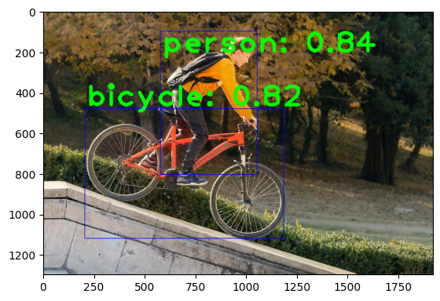
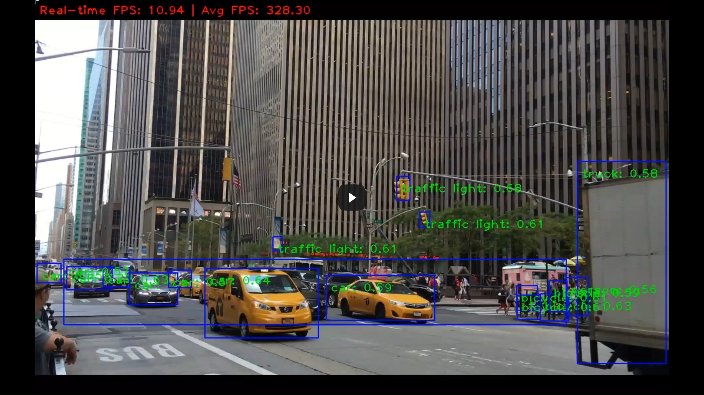

# Object-Detection and Classification
Real-time and Non-real-time Object Detection and Classification

This repository uses a pre-trained deep learning-based object detection and classification model "[MobileNet-SSD v3](https://github.com/opencv/opencv/wiki/TensorFlow-Object-Detection-API)" to detect, classify, and label objects belonging to 80 different classes by making use of the [MS COCO](https://cocodataset.org/#home) (Microsoft Common Objects in Context) dataset.

## Technical details
The coding was done fully in python using [Python v3.12.7](https://www.python.org/downloads/release/python-3127/) in [Jupyter Notebook v7.2.2](https://jupyter-notebook.readthedocs.io/en/stable/) through [Anaconda Navigator v2.6.4](https://www.anaconda.com/) platform. Labels were constructed and fixed/edited in [labels.txt](/labels.txt) file using [mscoco_label_map.pbtxt](https://github.com/tensorflow/models/blob/45ecd69155b8279d550e1d51f1cc01e5f0eeaebb/research/object_detection/data/mscoco_label_map.pbtxt) as a reference.

1. **Libraries used**
   - [OpenCV v4.10.0](https://opencv.org/releases/)
   - [matplotlib v3.9.3](https://matplotlib.org/stable/users/release_notes#version-3-9)

2. **Description of files used**
   - [ssd_mobilenet_v3_large_coco_2020_01_14.pbtxt](/ssd_mobilenet_v3_large_coco_2020_01_14.pbtxt)
     - This is the configuration file for the MobileNet-SSD v3 model, defining its architecture and settings. 
   - [frozen_inference_graph.pb](frozen_inference_graph.pb)
     - This is the pre-trained frozen model for the MobileNet-SSD v3 model, defining the weights, which represent learned parameters of the model.
   - [labels.txt](/labels.txt)
     - This is the text file where all the labels belonging to 80 different classes reside.
   - [source_code_image.ipynb](/source_code_image.ipynb)
     - This file contains the source code for object detection in an image.
   - [source_code_video.ipynb](/source_code_video.ipynb)
     - This file contains the source code for object detection in a video.

## Project Showcase

1. **Non-real-time Object Detection in a sample image**
   - Sample input image

     - To test with your own image, modify the code in 'In [7]' of file [source_code_image.ipynb](/source_code_image.ipynb) as shown below:\
       `img = cv2.imread('original_sample_image.jpg')` to `img = cv2.imread('your_image_name')`

   

   - Sample output image

   

2. **Non-real-time Object Detection in a sample video**
   - Sample input video
  
     - To test with your own video, modify the code in the very first line of 'In [10]' of file [source_code_video.ipynb](/source_code_video.ipynb) as shown below:\
       `cap = cv2.VideoCapture("original_sample_video.mp4")` to `cap = cv2.VideoCapture("your_video_name")`

     \
     
      
      
       
   - Sample output video

     - Due to limited resources of the machine, object detection happens at a slightly lower frame rate in the output video.
     - The video runs in full-screen by default. Press `f` to toggle between full-screen and windowed modes. Press `q` to stop object detection and close the video.
      
     
     
     
 

3. **Real-time Object Detection**

   - For Real-time Object Detection through the webcam or any other imaging device, modify the code in the very first line of 'In [10]' of file 
     [source_code_video.ipynb](/source_code_video.ipynb) as shown below:
     
     `cap = cv2.VideoCapture("original_sample_video.mp4")` to `cap = cv2.VideoCapture(0)`

     if `cap = cv2.VideoCapture(0)` does not work, or if there are multiple cameras, try changing the index `(0)` to 1, 2, etc. based on the camera to be used.
 

## Credits
[original_sample_image.jpg](Extras/original_sample_image.jpg) and [original_sample_video.mp4](Extras/original_sample_video.mp4) used in this project are copyright-free. Image is downloaded from [pixabay.com](https://pixabay.com/photos/boy-bicycle-stunt-child-riding-9201158/) and video from [pixabay.com](https://pixabay.com/videos/new-york-nyc-city-urban-manhattan-26115/). 

     
